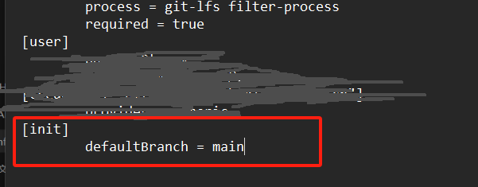
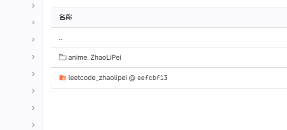
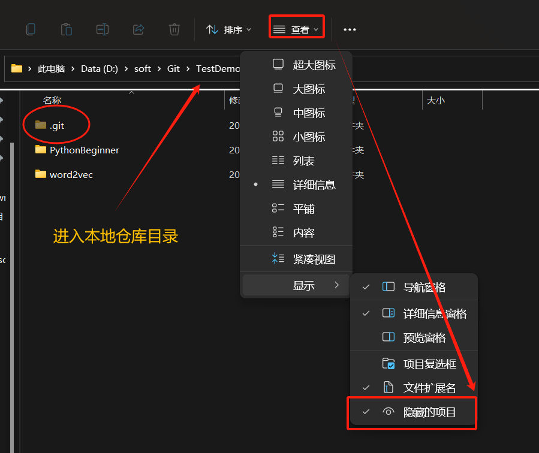
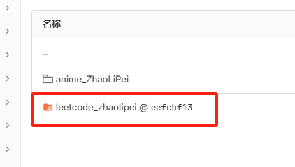
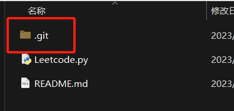

# Git上传出现报错及解决方法整理

# 1.上传到指定git仓库

要将现有的本地项目上传到一个新的 Git 仓库，你需要执行以下步骤：

### 1. 1在 Git 服务（如 GitHub、GitLab、Bitbucket 等）上创建一个新的空仓库。

### 1.2 在本地项目中初始化一个 Git 仓库（如果还没有）。

如果你的本地项目还没有关联到 Git 仓库，可以使用以下命令在项目目录中初始化一个新的 Git 仓库：

```
cd /path/to/your/local/project
git init
```

### 1.3 将本地项目与新创建的远程仓库关联。

使用以下命令将远程仓库 URL 添加为你的项目的远程：

```
git remote add origin <新远程仓库的URL>
```

注：在 Git 中，`origin` 是默认的远程仓库名称，目前自己另一远程仓库名。

确保将 `<新远程仓库的URL>` 替换为你新创建的远程仓库的实际 URL。

### 1.4 将本地更改提交并推送到新的远程仓库。

添加所有更改到暂存区，提交更改并将其推送到新的远程仓库：

```
git add .
git commit -m "Initial commit"  # 用适当的提交消息替换此处的 "Initial commit"
git push -u origin master  # 这将推送到远程仓库的 master 分支，如果你要推送到其他分支，请将 "master" 替换为正确的分支名称
```

### 注意事项：

- 确保你有权限将更改推送到新的远程仓库。
- 如果是首次推送，请确保本地的分支名称与远程分支对应，并将远程分支设置为跟踪分支。可以使用 `git push -u origin <branch_name>` 命令。

完成这些步骤后，你的本地项目就会被上传到新创建的远程仓库中。

## **疑问**

### 1.【关联仓库】每次新连接一个仓库就需要新建一个远程仓库吗，还是说直接替换已有远程仓库的URL

在 Git 中，你可以将一个本地仓库关联到多个远程仓库，而不需要每次都新建一个远程仓库。你可以通过 

```
git remote add origin <新远程仓库的URL>
```

 命令来添加多个远程仓库，然后在推送或拉取时选择要使用的远程仓库。

如果你已经有一个本地仓库，并且想要将其连接到另一个远程仓库，你可以执行以下步骤：

#### 1.1替换已有远程仓库的 URL

```
git remote set-url origin <new_remote_repository_URL>
```

将 `<new_remote_repository_URL>` 替换为新远程仓库的 URL。

这将更新已有远程仓库 `origin` 的 URL 为新提供的 URL。

#### 1.2添加额外的远程仓库（可选）

如果你希望保留原有的远程仓库，并且想要添加另一个远程仓库，可以使用以下命令：

```
git remote add <remote_name> <new_remote_repository_URL>
```

将 `<remote_name>` 替换为你想要使用的远程仓库的名称，`<new_remote_repository_URL>` 替换为新远程仓库的 URL。

这样，你就可以同时与多个远程仓库保持连接，并在需要时选择使用哪个远程仓库进行推送和拉取。

### 2.【查看远程仓库信息】如何查看远程仓库信息是否修改成功

要查看远程仓库的信息是否修改成功，可以使用以下 Git 命令来检查：

#### 2.1查看远程仓库列表

使用以下命令可以查看你的本地仓库关联的所有远程仓库：

```
git remote -v
```

这会列出所有远程仓库的名称和对应的 URL。如果你看到了正确的远程仓库名称和更新后的 URL，那么修改就成功了。

#### 2.2查看远程仓库详细信息

你也可以查看单个远程仓库的详细信息，比如特定远程仓库的 URL：

```
git remote show <remote_name>
```

将 `<remote_name>` 替换为你要查看的远程仓库名称。这会显示有关远程仓库的更多详细信息，包括 URL、跟踪的分支等。

通过这些命令，你可以确认远程仓库的信息是否成功修改或更新。


### 3.【删除远程仓库】我之前的远程仓库已经删除了，我git怎么更新呢

如果你的远程仓库已经被删除，你可以更新你的 Git 本地配置来移除该远程仓库的引用。使用下面的命令可以删除远程仓库的配置：

```
git remote remove origin
```

这将会移除名为 `origin` 的远程仓库引用。之后你可以添加一个新的远程仓库，方法是使用 `git remote add` 命令，指向你新的远程仓库地址。例如：

```
git remote add origin <新远程仓库URL>
```

然后你就可以像往常一样使用 `git push` 命令推送本地更改到这个新的远程仓库。


### 4.【删除远程仓库文件】

当需要删除远程仓库中的文件时，可以使用以下步骤：

1. **同步本地仓库与远程仓库：**

   ```
   git pull origin <branch_name>
   ```

   这确保了本地和远程仓库的同步。

2. **删除文件并提交更改：**

   ```
   rm <file_name>
   git add <file_name> //将已删除的文件添加到提交中
   git commit -m "Remove file_name"
   ```

3. **推送更改到远程仓库：**

   ```
   git push origin <branch_name>
   ```

   这将删除的文件也推送到远程仓库。

记得替换 `<file_name>` 为你要删除的文件名，`<branch_name>` 为你的分支名称。这些步骤将确保删除文件并将更改同步到远程仓库。

### 5.【如何修改默认分支】

修改默认分支：master -> main

#### 5.1方法一：直接使用git命令

```
git config --global init.defaultBranch main
```

#### 5.2.1方法二：找到git的配置文件 `.gitconfig`


#### 5.2.2在配置中添加如下图



然后这样但我们使用`git init`初始化某个项目时，默认就会使用main作为主分支

#### 5.3修改已有分支为main

​	1.切换到现主分支master

​	2.输入git命令

```
git branch -M main
```

`-M`：移动或者重命名当前分支

# 常见错误

## 1.本地仓库与新仓库关联时报错

出错时机：

​	1.可能将本地仓库与新远程仓库关联时

报错代码：

```
$ git remote add Project_ZhaoLiPei git@git.zhixingjidian.cn:neau-aigc/projectzhaolipei/zhaolipei.git 
error: remote Project_ZhaoLiPei already exists.
```

该错误表明名为 `Project_ZhaoLiPei` 的远程仓库已经存在于你的本地 Git 仓库中。

解决：

如果你想更新现有远程仓库的 URL，可以使用以下命令：

```
git remote set-url Project_ZhaoLiPei git@git.zhixingjidian.cn:neau-aigc/projectzhaolipei/zhaolipei.git
```

这会更新名为 `Project_ZhaoLiPei` 的远程仓库的 URL 为新提供的 URL。请确保将命令中的 `git@git.zhixingjidian.cn:neau-aigc/projectzhaolipei/zhaolipei.git` 替换为你想要设置的远程仓库的正确 URL。

## 2.未追踪远程分支报错

报错显示：

```
$ git push
fatal: The current branch main has no upstream branch.
To push the current branch and set the remote as upstream, use

    git push --set-upstream origin main

To have this happen automatically for branches without a tracking
upstream, see 'push.autoSetupRemote' in 'git help config'.

```

这个提示表明当前的分支没有追踪远程分支。

解决：

如果你想将当前分支推送到远程并与远程分支建立关联，可以使用命令：

```
git push --set-upstream origin main
```

这会将本地的 `main` 分支推送到远程仓库，并且建立追踪关系，使得今后的 `git push` 操作可以直接使用不带参数的 `git push`。

## 3.远程分支包含本地没有的提交

报错显示：

```
$ git push --set-upstream origin main
To git.zhixingjidian.cn:neau-aigc/projectzhaolipei/zhaolipei.git
 ! [rejected]        main -> main (fetch first)
error: failed to push some refs to 'git.zhixingjidian.cn:neau-aigc/projectzhaolipei/zhaolipei.git'
hint: Updates were rejected because the remote contains work that you do not
hint: have locally. This is usually caused by another repository pushing to
hint: the same ref. If you want to integrate the remote changes, use
hint: 'git pull' before pushing again.
hint: See the 'Note about fast-forwards' in 'git push --help' for details.

```

这个错误通常表示远程分支包含你本地没有的提交。这种情况可能是其他人或另一个仓库已经对远程分支进行了修改。你可以使用以下命令尝试拉取远程的更改并合并到本地分支：

```
git pull origin main
```

这将尝试将远程分支的更改拉取到你的本地仓库。然后再尝试进行推送：

```
git push origin main
```

如果 `git pull` 执行后出现冲突，请解决冲突后再进行提交和推送。

## 4.（本地分支和远程分支）的历史记录不相关时

报错显示：

```
$ git pull origin main
warning: no common commits
remote: Enumerating objects: 3, done.
remote: Counting objects: 100% (3/3), done.
remote: Compressing objects: 100% (2/2), done.
remote: Total 3 (delta 0), reused 0 (delta 0), pack-reused 0
Unpacking objects: 100% (3/3), 2.79 KiB | 150.00 KiB/s, done.
From git.zhixingjidian.cn:neau-aigc/projectzhaolipei/zhaolipei
 * branch            main       -> FETCH_HEAD
 * [new branch]      main       -> origin/main
fatal: refusing to merge unrelated histories


```

"refusing to merge unrelated histories" 错误通常发生在两个分支（本地分支和远程分支）的历史记录不相关时，导致 Git 拒绝合并这两个分支的提交历史。

这个错误可能是因为两个不同的仓库有着不同的历史记录，可能是你在远程仓库创建了一个新的仓库，或者你在本地创建了一个新的仓库，然后尝试将它们合并。

如果你确定想要将两个不相关的历史记录合并成一个新的提交历史，可以通过以下命令强制进行合并：

```
git pull origin main --allow-unrelated-histories
```

这会强制 Git 将两个不同历史记录的分支进行合并。

但是请注意，合并不相关的历史记录可能导致混乱，因为这样的合并可能会破坏项目的一致性。最好的方式可能是创建一个新的分支来包含新的历史记录。

## 5.本地仓库文件与远程仓库冲突

报错显示：

```
$ git pull origin main --allow-unrelated-histories
From git.zhixingjidian.cn:neau-aigc/projectzhaolipei/zhaolipei
 * branch            main       -> FETCH_HEAD
Auto-merging README.md
CONFLICT (add/add): Merge conflict in README.md
Automatic merge failed; fix conflicts and then commit the result.

```

解决：

这个输出表示在合并过程中发生了冲突。发生冲突时，Git 无法自动解决这些问题，因此需要手动解决。

可选择直接选择删除冲突文件再add,commit，

或者如下：

1. 打开发生冲突的文件（在此示例中是 `README.md`）。
2. 在文件中找到标记了冲突的部分。这些部分通常包含 `<<<<<<<`, `=======`, 和 `>>>>>>>` 标记，分别表示两个分支的不同版本。
3. 解决冲突：手动编辑文件，选择想要保留的内容或者合并两个版本的内容。删除不需要的标记行 (`<<<<<<<`, `=======`, `>>>>>>>`)。
4. 保存文件，然后添加并提交解决冲突后的文件：

```
add README.md
git commit -m "Resolve merge conflict in README.md"
```

完成以上步骤后，就成功解决了合并冲突。接下来你可以继续进行推送或其他操作。

## 6.仓库嵌套，远程仓库显示红色文件格雷码

本地文件夹提交到远程仓库后不是文件夹，而是一个红色图标名字为leetcode_zhaolipei @ eefcbf13的文件，也打不开




错误原因：

如果您将本地文件夹提交到远程仓库，但在远程仓库中看到的是一个红色图标的文件名为 "leetcode_zhaolipei @ eefcbf13"，这可能是因为您在本地的文件夹里包含了一个嵌套的 Git 仓库。

通常情况下，提交一个嵌套的 Git 仓库不会以文件夹的形式显示，而是以单个文件的形式显示在远程仓库中。这个文件实际上代表了嵌套的 Git 仓库，包括其历史记录和内容。

为了解决这个问题，您可以考虑以下几种方法：

### 6.1**清理嵌套的 Git 仓库：**

 删除嵌套的 Git 仓库，并确保您的主要仓库不包含嵌套的 Git 仓库。您可以通过删除嵌套的 `.git` 文件夹或者将嵌套的 Git 仓库移出您的主要仓库文件夹来实现。然后提交并推送这些更改到远程仓库。

​	**步骤：**

#### 6.1.1**确认并备份重要数据：**

在开始任何更改之前，请确保备份了重要的数据，以免意外删除数据导致丢失。

#### 6.1.2**删除嵌套的 .git 文件夹：** 

**进入包含嵌套** Git 仓库的文件夹，并删除名为 `.git` 的文件夹。在大多数操作系统中，这是隐藏的文件夹，您可能需要启用显示隐藏文件选项才能看到它。删除此文件夹将删除嵌套的 Git 仓库历史记录和设置。

##### 6.1.2.1打开隐藏文件



##### 6.1.2.2寻找嵌套仓库`.git`文件

因为红色格雷码文件名为`leetcode_zhaolipei @ eefcbf13`,我们便去本地这个文件目录下寻找



找到文件

​	

发现隐藏.git文件



直接删除

#### 6.1.3**确保主要仓库文件夹不包含嵌套的 Git 仓库：**

确认主要仓库文件夹中不再包含嵌套的 `.git` 文件夹。如果主要仓库文件夹中包含了嵌套的 Git 仓库，请将该嵌套仓库移出主要仓库文件夹。

#### 6.1.4**提交更改到本地仓库：**

在完成上述更改后，使用以下命令将更改提交到本地仓库：

```
git add .
git commit -m "Remove nested Git repository"
```

#### 6.1.5**推送更改到远程仓库：** 最后，使用以下命令将更改推送到远程仓库：

```
git push origin main
```

1. **使用子模块（Submodule）：** 如果您想要保持嵌套仓库的独立性，可以将它们设置为 Git 子模块。这样，您可以在主仓库中添加子模块，而远程仓库会正确地处理它们，并在其中显示文件夹。
2. **删除远程仓库中的文件：** 如果您已经提交了错误的内容到远程仓库，可以使用 `git rm` 命令删除文件，然后提交这些更改到远程仓库。但是，请务必确保在执行删除操作之前备份您的数据，以免丢失重要内容。

### 6.2**使用子模块（Submodule）**

#### 6.2.1命令

要将一个已有的 Git 仓库设置为子模块，可以使用以下命令：

```
git submodule add <URL_to_repository> path/to/submodule
```

这将在主仓库中添加子模块，并且将子模块所在的路径添加到主仓库中。例如，如果您有一个名为 `submodule-repo` 的仓库，您可以执行以下操作：

```
git submodule add https://github.com/example/submodule-repo.git path/to/submodule
```

这将把名为 `submodule-repo` 的远程仓库作为子模块添加到您的主仓库中，并且在 `path/to/submodule` 目录下初始化该子模块。接下来，您需要提交这些更改到主仓库。

要提交对子模块的更改，您需要先进入子模块目录，执行 `git add` 和 `git commit` 命令，然后返回到主仓库并提交主仓库的更改。以下是一般的流程：

#### 6.2.2**添加更改并提交子模块：**

```
cd path/to/submodule
# 在子模块中进行修改、添加文件等操作
git add .
git commit -m "Commit message for submodule changes"
```

#### 6.2.3**返回主仓库：**

```
cd /path/to/main/repository
```

#### 6.2.4**更新主仓库记录子模块更改：**

```
add path/to/submodule  # 或者使用 git add . 来添加所有更改
git commit -m "Updated submodule to latest version"
```

#### 6.2.5**最后，推送主仓库的更改到远程仓库：**

```
git push origin main
```

这样您就可以提交主仓库和子模块的更改到各自的远程仓库中。


### 6.3**删除远程仓库中的文件**

要删除远程仓库中的文件，可以按照以下步骤操作：

#### 6.3.1**删除本地文件并提交更改：**

首先，在本地执行删除操作：

```
git rm <file_name>
git commit -m "Remove file_name from repository"
```

或者，如果要删除整个文件夹：

```
git rm -r <folder_name>
git commit -m "Remove folder_name from repository"
```

#### 6.3.2**推送更改到远程仓库：**

推送本地的更改到远程仓库：

```
git push origin main
```

请确保替换 `main` 为您要推送的分支名称。

注意：删除文件会导致文件在版本历史中的消失。如果有其他人正在依赖这些文件，删除它们可能会导致问题。因此，请确保您清楚地知道删除的后果。


